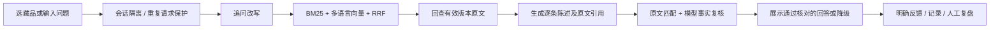

# MUSE · 博物馆随行助手（原馆语）

面向现场拍照、听讲解和继续追问的个人 AI 产品作品。基于经项目持有人授权的文枢课程代码二开；与芝加哥艺术博物馆、V&A 均无隶属关系，不代表在馆方上线。

## 当前状态（2026-09-29）

代码已发布到 [GitHub](https://github.com/mitsuki3693/museum_agent)；应用代码提交 `7ac23d6` 的 [Actions 检查已通过](https://github.com/mitsuki3693/museum_agent/actions/runs/36545829709)。

- 原版 59 项离线测试通过；初版交付时共 81 项测试通过，历史记录见 `docs/combined-tests.xml`。
- 网页生产构建通过，真实本地多语言向量模型已运行。
- 已导入 12 件公开藏品，准备 40 道待人工复核问题。
- DeepSeek 密钥已在本地配置，单件藏品的真实生成与引用核对已跑通，保留失败与修复记录。这不是正式准确率评测；未配置密钥的副本显示“资料检索模式”。
- 当前本机运行使用内存存储：重启会清空会话、执行记录和反馈。MongoDB 适配及可选容器配置已提供，尚未实机验证。
- 离线检索报告只是小样本工程检查，不是回答准确率、线上 A/B 测试或真实用户成效。

## 9 月 29 日后续版本

- 支持作品图片确认、口语找画、HTTP 局域网手机会话兼容，以及简明／深入／儿童讲解入口。
- 增加可选的本地 V&A 官方英文讲解试点；中文内容是项目改写，不是馆方官方中文稿。私有数据不会随仓库发布，见 [讲解库说明](docs/local-narration-library.md)。
- 增加 DINOv2 图片特征检索，与文字候选合并后核对参考图。默认关闭，通过本地参考图库显式启用，见 [实现、配置与测评边界](docs/visual-retrieval.md)。
- 游客入口整合为连续聊天：底部始终保留文字、拍照、相册、语音入口；照片和原问题在确认作品后衔接，简明／深入／儿童版通过回答下方选项递进。见 [聊天入口与验收记录](docs/chat-interface.md)。
- 前端以 MUSE 为独立英文名称，使用黑紫背景、白色字标与少量暖黄强调；没有使用馆方标志，不代表馆方官方应用。
- 新增对话内路线规划：确认时间、兴趣与起点后，在有来源的有限展厅图上推荐顺序，支持跳过重算；找出口、楼梯／电梯、厕所和服务台独立读取馆方设施说明与位置链接。地图、实馆数据和本地验证记录不公开，见 [路线规划说明](docs/route-planning.md)。
- 路线卡附带分层 SVG 点线示意，可播放模拟位置并切换楼层；布局和移动速度为演示设定，明确标注模拟，没有接入设备定位。
- 本地 Python 自动化检查现为 140 项；最新前端网络回归 4 项通过，前端类型检查及生产构建通过。前述 Actions 链接是历史提交的结果，不代表这些后续改动已经运行云端 CI。

## 本地运行（Windows / Python 3.12 / Node 22+）

在仓库根目录执行：

```powershell
uv venv .venv
uv pip install --python .venv/Scripts/python.exe -r requirements-vector.lock
uv pip install --python .venv/Scripts/python.exe --no-deps -e backend
Copy-Item .env.example .env
.venv/Scripts/python.exe -c "from sentence_transformers import SentenceTransformer; SentenceTransformer('sentence-transformers/paraphrase-multilingual-MiniLM-L12-v2', cache_folder='models')"
```

只在本地 `.env` 填写 `DEEPSEEK_API_KEY`。当前官方模型名 `deepseek-flash`，详见 [DeepSeek 文档](https://api-docs.deepseek.com/updates/)。不要提交 `.env`。

分别在两个终端启动：

```powershell
./scripts/start-backend.ps1
```

```powershell
cd web
npm ci --ignore-scripts --no-audit --no-fund
npm run dev -- --hostname 127.0.0.1 --port 3000
```

打开 http://127.0.0.1:3000 。管理页 `/review` 需要 `.env` 中设置独立的 `MUSEUM_ADMIN_TOKEN`，未设置时关闭访问。修改 `.env` 后重启后端。

如果还未下载向量模型，可以将 `MUSEUM_EMBEDDING=lexical` 明确切到 BM25 检索；这不是语义向量检索。`local` 模式模型缺失会启动失败，不会偷偷改用 hash 向量。

## 游客入口（依据用户反馈于 9 月 29 日调整）

拍作品或展签 → 图片特征检索（可选）＋可见文字检索 → 照片与候选记录／参考图核对 → **游客确认作品** → 有依据的讲解 → 点击播放 / 语音追问。名称搜索为备用入口。

图片仅在点击发送后交由 DeepSeek 处理；后端检查大小、格式、像素数，去除 EXIF 后发送，不保存原图。照片预览只在当前页面内存中保留，新对话或离开页面后释放。浏览器语音识别可能由浏览器厂商远端服务处理，文本须用户确认后发送。语音播放依赖设备可用的中文音色；不能声称已验证所有手机。

公开仓库覆盖 12 件文字示范馆藏，本地 V&A 试点增加 1 件。当前图片参考库只覆盖其中 4 件；不能将文字库规模当作视觉识别覆盖率。这不是通用文物鉴定。参观路线使用独立核对的地图快照，覆盖范围与作品识别库不同；没有室内定位或实时通行信息，不能作为实时导航。

## 最小产品链路



保留课程的 `BM25Index`、`HybridRetriever`、`MemoryVectorStore`、`EmbeddingClient`、`DeepSeekClient` 和存储接口。博物馆入口为 `app.museum.api:app`；旧校园入口 `app.main` 不属于当前演示。未启用 pi、Redis、校园路由、自进化、Milvus、神经重排、K8s。

## 检查和评测

```powershell
.venv/Scripts/python.exe -m pytest backend/tests -q
.venv/Scripts/python.exe -m scripts.evaluate_museum
cd web
npm run build
```

`eval/questions.json` 共 40 题。先复核问题、原文、预期行为，再把 `reviewed` 设为 `true`；不要批量机械勾选。当前检索脚本对其中 24 道独立且有来源的题比较 BM25 与混合检索；追问、拒答和边界题另行进行完整回答检查。

`--answers` 只在全部题目已复核且有密钥时允许付费运行，并留下待人工评分的回答。模型审查通过不等于人工认定正确。见 [评测说明](docs/evaluation.md)。

## 资料与许可

数据来自 [Art Institute of Chicago 官方 API](https://api.artic.edu/docs/)，保留原始响应、来源 URL、采集时间、来源哈希。

**实际接口响应明确：description 为 CC BY 4.0，其余元数据为 CC0。**馆方介绍已去除 HTML 标签，并添加中文字段标签；作者为 Art Institute of Chicago，作品级来源链接见每条记录，许可见 [CC BY 4.0](https://creativecommons.org/licenses/by/4.0/)。3 张示例图片来自公有领域复制图，单独记录于 `data/image-provenance.json`；V&A 试点素材只保存在本地忽略目录。不声称提供实时展位或开放状态。

刷新资料：`.venv/Scripts/python.exe -m scripts.import_artic`。刷新后须重新复核评测集。

## 维护边界

- 仅监听本机；默认限制同时处理 2 个问题。这不是高并发认证或公开生产部署。
- 会话 token 随机生成，服务端只存其哈希，30 分钟后失效。当前单进程会话锁和限流不能用于多副本部署。
- 相同会话的相同请求编号会复用结果；请求编号与输入不一致返回冲突。
- 原始候选、生成草稿、核对结果、最终状态、模型 usage 分开记录；不伪造置信度或美元费用。
- 反馈只收集明确操作，不把追问默认当作不满意。
- 后续扩展必须保留引用、失败降级与回归检查。已有有限真实照片开发检查及简明／深入／儿童讲解；仍待用户体验评审，不能推广为任意照片都能识别。已加入有限馆区路线与设施查询；文保环境工具尚未实现。

详细见 [PRD](docs/PRD.md)、[已验证证据](docs/evidence.md)、[来源及修改归属](docs/provenance.md)。

图像开发检查：已完成四张合成控制图的真实模型调用，首轮包含一次失败，单独复测保留原记录。见 [图像评测说明](docs/photo-evaluation.md)，不能表述为真实照片识别准确率。
