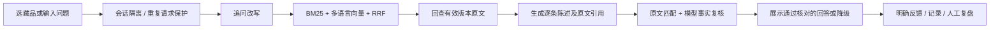

# 馆语 · 博物馆可信问答 Agent

面向现场拍照、听讲解和继续追问的个人 AI 产品作品。基于经项目持有人授权的文枢课程代码二开；与芝加哥艺术博物馆、V&A 均无隶属关系，不代表在馆方上线。

## 当前状态（2026-09-29）

- 原版 59 项离线测试通过；当前共 77 项测试通过，见 `docs/combined-tests.xml`。
- 网页生产构建通过，真实本地多语言向量模型已运行。
- 已导入 12 件公开藏品，准备 40 道待人工复核问题。
- DeepSeek 接口已接入代码，但尚未配置密钥、未进行真实生成验证。没有密钥时明确显示“资料检索模式”。
- 当前本机运行使用内存存储：重启会清空会话、执行记录和反馈。MongoDB 适配及可选容器配置已提供，尚未实机验证。
- 离线检索报告只是小样本工程检查，不是回答准确率、线上 A/B 测试或真实用户成效。

## 本地运行（Windows / Python 3.12 / Node 22+）

在仓库根目录执行：

```powershell
uv venv .venv
uv pip install --python .venv/Scripts/python.exe -r requirements-vector.lock
uv pip install --python .venv/Scripts/python.exe --no-deps -e backend
Copy-Item .env.example .env
.venv/Scripts/python.exe -c "from sentence_transformers import SentenceTransformer; SentenceTransformer('sentence-transformers/paraphrase-multilingual-MiniLM-L12-v2', cache_folder='models')"
```

只在本地 `.env` 填写 `DEEPSEEK_API_KEY`。当前官方模型名 `deepseek-flash`，详见 [DeepSeek 文档](https://api-docs.deepseek.com/updates/)。不要提交 `.env`。

分别在两个终端启动：

```powershell
./scripts/start-backend.ps1
```

```powershell
cd web
npm ci --ignore-scripts --no-audit --no-fund
npm run dev -- --hostname 127.0.0.1 --port 3000
```

打开 http://127.0.0.1:3000 。管理页 `/review` 需要 `.env` 中设置独立的 `MUSEUM_ADMIN_TOKEN`，未设置时关闭访问。修改 `.env` 后重启后端。

如果还未下载向量模型，可以将 `MUSEUM_EMBEDDING=lexical` 明确切到 BM25 检索；这不是语义向量检索。`local` 模式模型缺失会启动失败，不会偷偷改用 hash 向量。

## 游客入口（依据用户反馈于 9 月 29 日调整）

拍作品或展签 → 模型提取可见信息 → 检索当前馆藏 → 照片与候选记录核对 → **游客确认作品** → 有依据的讲解 → 点击播放 / 语音追问。名称搜索为备用入口。

图片仅在点击识别后发送 DeepSeek；后端检查大小、格式、像素数，去除 EXIF 后发送，不保存原图。浏览器语音识别可能由浏览器厂商远端服务处理，文本须用户确认后发送。语音播放依赖设备可用的中文音色；不能声称已验证所有手机。

当前只覆盖 12 件示范馆藏，不是通用文物鉴定。缺少可靠楼层/展位图，暂不提供实地导航。

## 最小产品链路



保留课程的 `BM25Index`、`HybridRetriever`、`MemoryVectorStore`、`EmbeddingClient`、`DeepSeekClient` 和存储接口。博物馆入口为 `app.museum.api:app`；旧校园入口 `app.main` 不属于当前演示。未启用 pi、Redis、校园路由、自进化、Milvus、神经重排、K8s。

## 检查和评测

```powershell
.venv/Scripts/python.exe -m pytest backend/tests -q
.venv/Scripts/python.exe -m scripts.evaluate_museum
cd web
npm run build
```

`eval/questions.json` 共 40 题。先复核问题、原文、预期行为，再把 `reviewed` 设为 `true`；不要批量机械勾选。当前检索脚本对其中 24 道独立且有来源的题比较 BM25 与混合检索；追问、拒答和边界题另行进行完整回答检查。

`--answers` 只在全部题目已复核且有密钥时允许付费运行，并留下待人工评分的回答。模型审查通过不等于人工认定正确。见 [评测说明](docs/evaluation.md)。

## 资料与许可

数据来自 [Art Institute of Chicago 官方 API](https://api.artic.edu/docs/)，保留原始响应、来源 URL、采集时间、来源哈希。

**实际接口响应明确：description 为 CC BY 4.0，其余元数据为 CC0。**馆方介绍已去除 HTML 标签，并添加中文字段标签；作者为 Art Institute of Chicago，作品级来源链接见每条记录，许可见 [CC BY 4.0](https://creativecommons.org/licenses/by/4.0/)。不下载图片，不声称提供实时展位或开放状态。

刷新资料：`.venv/Scripts/python.exe -m scripts.import_artic`。刷新后须重新复核评测集。

## 维护边界

- 仅监听本机；默认限制同时处理 2 个问题。这不是高并发认证或公开生产部署。
- 会话 token 随机生成，服务端只存其哈希，30 分钟后失效。当前单进程会话锁和限流不能用于多副本部署。
- 相同会话的相同请求编号会复用结果；请求编号与输入不一致返回冲突。
- 原始候选、生成草稿、核对结果、最终状态、模型 usage 分开记录；不伪造置信度或美元费用。
- 反馈只收集明确操作，不把追问默认当作不满意。
- 后续扩展必须保留引用、失败降级与回归检查。照片识别已接入代码（待真实模型验收）；亲子讲解、路线规划、文保环境工具未实现。

详细见 [PRD](docs/PRD.md)、[已验证证据](docs/evidence.md)、[来源及修改归属](docs/provenance.md)。
