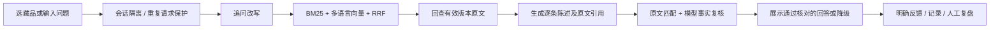

# MUSE · 博物馆随行助手（原馆语）

面向现场拍照、听讲解和继续追问的个人 AI 产品作品。基于经项目持有人授权的文枢课程代码二开；与芝加哥艺术博物馆、V&A 均无隶属关系，不代表在馆方上线。

## 当前状态（2026-10-10）

**统一分层评测面板已接入真实 MongoDB。** 在 `/review#evaluations` 使用现有管理凭据，可筛选五类业务评测与独立工程可靠性批次，查看指标分母、人工复核、采用决定及版本。当前 19 批为文字检索 9、问答 1、识图 9；路线／文保等空缺明确标注，不补模拟分数，不把已拒绝实验当成上线成功。519 项后端和 13 项前端测试、生产构建及桌面／390px 浏览器检查通过。见[交付与下一步](docs/evaluation-dashboard.md)。

**已完成主体框裁剪后重新提特征的全库对照，未启用。** 固定 42 张开发图及 1,006 张参考图，分别比较原图、只裁查询和两侧裁剪。20 张角度／局部图的 Top5 均为 14/20；一张雕塑背面从第 8 降至 35，且透明玻璃支撑被误裁。停止这套固定 GrabCut 方案，保留现有识图链路；509 项后端测试通过、零图片 API 调用。见[实验与取舍](docs/foreground-crop-evaluation.md)及[摘要](docs/foreground-crop-results.json)。

**局部识图完成一轮可复现诊断，已接入 OCR 完整编号独立召回。** 42 张旧图的实际检索与历史 Top10 全部一致。只改裁剪分数汇总时，20 张角度图的 Top5 从 14 到 15，但海神全貌发生退化，因此没有启用这个排序实验。新增编号路径保留源校验、图像核对和游客确认；手工转录的千件库对照没有新增命中，不能宣称识图精度提升。500 项后端测试通过；见[对照、取舍与后续](docs/photo-crop-aggregation.md)及[脱敏摘要](docs/photo-crop-aggregation-results.json)。

**已增加选定作品后的编目字段直答及普通问答分阶段计时。** 本机 12 条作者／年代／材质问题通过实际网页代理，28–57ms，零模型调用；三种既有预编讲解继续可用。开放式追问仍执行完整事实提取、生成与核验，本次一条约 5.6 秒。全库可直接引用字段为作者 800、年代 840、材质 752 条，这是字段覆盖数，不是自然语言准确率。476 项后端回归通过，Trace、反馈和精简评测已从 MongoDB 读回；见 [普通问答验收](docs/evaluation.md#普通问答分段计时与编目字段直答2026-10-10)及[脱敏结果](docs/catalogue-answer-results.json)。

**千件馆藏本地网页已启用 BGE ONNX INT8 与超时自动恢复。** 保留最多 25 候选、256 tokens；固定 107 条重排查询中 103 条有 gold，原版与 INT8 的 Top5 都为 100/103，没有新增前五漏召回，但 3 条目标名次后移。12 题各 3 轮的预热后重排 P95 从 8.100 秒降至 3.422 秒，0/36 超时；强制超时后自动恢复通过。这不是整段问答延迟或游客准确率。见 [重排性能与故障恢复](docs/rerank-latency.md)及[实测摘要](docs/rerank-latency-results.json)。

上轮本机实际网页的作者／年代 13 条查找查询全部通过、零 LLM 调用；中文找作品两次均返回目标，冷／热请求的重排分别约 7.38／3.89 秒，端到端约 9.92／6.15 秒，当时 454 项后端回归通过。AIC《American Gothic》已核实未标为公有领域，不下载图片，明确记录缺图原因。1,000 条 V&A 加 12 条 AIC 共 1,012 条记录未变，视觉索引仍覆盖 1,003 条记录、1,006 张参考图；该重排轮次没有修改识图算法。

上一轮作者／年代字段路由的旧 114 题 Top1 从 91 到 94、Top5 从 110 到 112，无新增目标排名退化；与本轮实际进入 BGE 的题集分母不同，不能直接比较。见 [字段路由、对照与边界](docs/catalogue-metadata.md)；更早的[中文词表修复](docs/catalogue-glossary.md)保留原始分数。

993 条可用 V&A 完整编号已通过上一轮路由检查，facts 问答流程为 v13；默认安装策略仍为 legacy。作品选择器分批显示 24 条并支持全库名称／编号过滤。上一轮的前端构建、网页图片、持久化及恢复检查见 [千件库收尾记录](docs/scale-1000-closeout.md) 和 [当时实测摘要](docs/scale-1000-results.json)。开放式问答的长期质量与时延、复杂字段条件、局部／背面识图仍待验证，不能写成“千件精准识别”或生产验收。本机入口：<http://127.0.0.1:3000/>，仅电脑本机访问。

## 历史开发记录（下列状态以当时实验为准）

本机网页已进入 **v12 组合流程的受控试用**（仅当前进程，`.env` 和默认 legacy 不变）。专名优先保留馆方原文；修复了检索改写丢失“早餐”限定后污染回答任务的问题。真实浏览器复测中，未记载问题两次显示资料不足，产地追问有回答；但简明讲解仍出现一次“两条已选证据合并后被单段范围检查误拦”，未整体验收通过。两轮网页共九条指定 Trace、两条开发反馈均从 MongoDB 读回；408 项后端回归通过。下一步修复这个证据范围误拦，仍不扩库。见 [网页验收和剩余问题](docs/evaluation.md#专名表述与真实会话问题保真2026-10-08)。

组合问答完成四题对照并修复一处真实漏检：模型曾把孤立地点列表解释成制作／装饰分工，语义核对误放。实验 facts 路径现排除这种证据，并在展示前拦截再次单独引用地点标签的回答，升级为 v10；默认旧流程不变。修复后同题为三条回答、一条资料不足，两条瓶子回答的阶段与引文相符；执壶中文工厂名仍待统一审核，不计为完整验收。406 项后端回归通过，网页尚未切换。见 [组合流程与关系证据修复](docs/evaluation.md#组合问答与地点关系证据保护2026-10-08)。

核对器校准已完成首轮：新增默认关闭的逐条事实／问题回应／照片身份三维审查，由代码汇总通过条件。14 个固定开发样例中，旧版 5 条支持回答通过、9 条反例拒绝；新版 4 条通过、8 条拒绝、2 次服务错误，已返回的判定均符合开发标签。原样重放上轮两份真实失败草稿，旧版均拒绝、新版均通过；因缺少人工标签，不能称为准确率提升。401 项后端回归通过。网页仍用旧版，下一步固定少量问题验证“事实提取→短答重组→新核对”完整链路。见 [核对校准结果](docs/evaluation.md#核对器分维度校准2026-10-08)。

超长回答处理已增加默认关闭的重组开关：保留整份草稿，使用原有一次修正机会重新组织，合格短答仍需事实核对；不再在该实验路径直接截取前两条。固定同一真实超长草稿三次，均压成两条并保留产地／风格解释，但两次语义核对拒绝、一次核对服务错误，因此尚未启用网页。382 项后端回归通过。下一步单独校准否定／推论的核对判定，保留明确错事实的反例；不再把截断当作唯一原因。见 [重组验证及边界](docs/evaluation.md#超长回答重组与固定草稿复测2026-10-08)。

新增默认关闭的 facts 事实提取实验：先区分制作／装饰／风格并验证逐字证据，再生成和独立核对。两件藏品八题交替对照中，新流程四条回答、两条正确拒答、两条服务错误；旧流程两条回答、两条拒答、三条核对失败、一条服务错误，均非人工准确率。混合产地瓶子的“中国制作、代尔夫特加彩”在定向复测中保持正确；原执壶错误前提仍失败，且发现简明模式截取前两条可能丢失解释。375 项回归通过；未切网页或扩库。下一步修复超长回答的处理，再做验收。见 [结构化事实对照](docs/evaluation.md#结构化事实提取与两件藏品对照2026-10-08)。

产地追问完成五轮四题小型对照：固定同一件作品、历史与模型，共 20 次任务。直接问产地有所改善，但修正版第一次通过后重复仍失败；加严地理引用又造成退化，因此三个提示词实验均未启用。确认生成和审查都可能不稳定，不能只计“Verifier 通过”。已加入默认关闭的回答策略、修正上下文回归、逐调用耗时及离线回放，363 项后端测试和 20 项响应回放通过。网页仍使用原回答策略，问题尚未完整修复。下一步验证结构化事实与回答组织的分离，见 [实验结果与未通过条件](docs/evaluation.md#产地追问的生成与修正实验2026-10-08)。

中文检索已在本机 112 件语料网页开启受控试用：真实页面完成两次口语找作品、确认后简明讲解、儿童版与一次连续追问；五条 Trace 和两条测试反馈已从 MongoDB 读回。两次查找均显示目标图片，讲解切换保持作品，但产地追问的两版生成稿均自相矛盾，被核对正确拦截；简明讲解单次约 26 秒。不是准确率或稳定性验收，未扩库。下一步定位否定／产地问答的生成与修正，不放松 Verifier。见 [网页结果与后续任务](docs/chinese-fields-bm25f.md#中文检索桌面网页试用2026-10-08)。

中文降级漏搜修复完成：有限中英词表仅在至少两个不同线索时追加检索词，避免单个“蓝色／镀金”干扰精确中文匹配。固定开发题的大库基础 Top5 从 110/114→114/114，小库仍 81/82，无新增前五失败；一件相似花瓶仍由首位退到第二位。正常重排候选与原文不变，362 项后端测试及 13 项真实 HTTP 检查通过。保留覆盖率规则、无条件词表两次失败；开关默认关闭，下一步受控网页试用，未完成 1,000 件验收。见 [修复、失败与实际接口证据](docs/chinese-fields-bm25f.md#基础回退的中英细节检索2026-10-08)。

新版中文召回已接为默认关闭的服务开关：212 次真实检索检查中，184 次原文组装＋已有分数回放与冻结结果一致，28 次走中文名称直达；正常路径前五 82/82、114/114。繁忙／关闭重排时的基础检索提升至 81/82、110/114，但大库三道细节题新增漏搜，因此网页未启用。8 项真实 HTTP／BGE 检查及 358 项后端测试通过；前几条请求超过默认 8 秒预算，尚非稳定性验收通过。下一步修回退排序并复查时延。见 [接线、失败及启用限制](docs/chinese-fields-bm25f.md#中文召回服务接线与回退验收2026-10-08)。

同文候选排序已稳定：仅对完全相同的实际输入文字保留原召回顺序，原始分数不取整、作品不合并。212 次固定分数重放中，新旧分批全部候选排序一致；3 道故障题的 6 次真实模型对照和 8 项真实接口复验通过，351 项后端测试通过。前五命中仍为 82/82、114/114，不把偶然首位变化当作质量提升。新规则随实验分批开关生效，默认关闭、网页未改；下一步接入中文召回和基础回退。见 [同文规则、证据和边界](docs/chinese-fields-bm25f.md#完全相同证据的稳定排序2026-10-08)。

长度分批全题与真实接口验收完成：212 次查询的前五集合相同，目标命中仍为 82/82、114/114；但 3 条前五顺序因完全相同证据的浮点差异改变，严格排序不变未通过，因此新开关默认关闭、网页未启用。8 项真实本机 HTTP／子进程检查通过，覆盖正常重排、繁忙回退、超时终止、熔断后回退和关闭开关；342 项后端测试通过。下一步修复同文候选的稳定并列规则，不将偶然首位变化当作质量提升。见 [全题结果与接口边界](docs/chinese-fields-bm25f.md#完整排序回归未满足严格排序不变2026-10-08)。

长度分批性能探针完成：保留全部候选和原文，六题各三轮交替新旧方案，配对耗时中位数减少约 19.6%；18 次测量中超过 8 秒由 9 次降至 2 次，样本候选排序全部保持一致。339 项后端测试通过；选项默认关闭，尚待全题排序回归及真实接口验收，不能将六题重复测量当作线上时延指标。见 [性能对照与启用条件](docs/chinese-fields-bm25f.md#保留全部候选的长度分批性能对照2026-10-08)。

材质误排与花瓶退化的离线修复已完成全题对照：明确材质查询依据馆方材质字段优先排序，模型原文输入只清除精确重复标题。大理石题回到首位，棱纹花瓶从小库第 4／大库第 5 恢复到第 2；196 项共同基线无新增目标名次下降，前五仍为 82/82、114/114，336 项后端测试通过。95 次新推理中仍有 19 次超过 8 秒，尚未启用网页。直接裁减候选会重新漏搜，下一步验证保留候选的分批计算优化。见 [四组对照、边界与性能约束](docs/chinese-fields-bm25f.md#材质条件与重复标题的独立对照2026-10-08)。

中文候选回查馆方原文后接固定 BGE 的完整离线对照已完成：212 次查询（122 个不同问题），共同旧基线 196 项中，小库前五 76/82→82/82、大库 107/114→114/114，无新增前五失败；仍有大理石材质误排、花瓶名次下降和部分答案集合不穷尽。99 次新推理中 46 次超过 8 秒，其余 113 次为完全相同输入的已有结果复用，不计入新耗时。313 项后端测试通过；网页未切换，尚非正式准确率或 1,000 件验收。详见 [完整结果、失败与接入条件](docs/chinese-fields-bm25f.md#中文候选回查原文再做固定重排2026-10-08)。

已修复完整中文名称被模糊搜索挤掉的问题：本地网页输入“找参孙击杀非利士人的雕塑”可返回正确确认候选，约 1.54 秒后台处理；同名作品保留原相对顺序。306 项后端测试通过。另完成中文召回离线修复：大库七道旧漏召回全部进入候选，但基础搜索仍新增三道 Top5 退化，完整 BM25F 尚未上线。网页仍为 112 件，见 [字段、对照结果和回滚](docs/chinese-fields-bm25f.md)。

文字重排已在本地 112 件藏品网页开启小范围试用，公开默认配置仍关闭。桌面浏览器实际完成三次重排、两次预编讲解及一次繁忙回退，六条 Trace 与两条反馈已写入 MongoDB。睡莲口语搜索正确展示图片；相似花器仍需用户确认，目标排第二；繁忙回退中的参孙查询未找到作品，已留为失败案例。不是手机、负载或 1,000 件馆藏验收。上一轮 296 项后端测试通过，见 [配置、实测与边界](docs/reranker-service.md)。

短证据重排完成 **196 项完整回归**（114 个不同问题在两个语料规模上测试）：固定模型和候选，仅将原文组装预算降至 256 tokens；相对最初 BGE 重排，小库前五 76/82 保持不变，大库 105/114→107/114，无新增前五失败，但仍有首位降至第 2 的相似器物问题。大库本轮重排 P50/P95 约 6.60/9.14 秒；同进程交替计时中，木雕题由 11.81 秒降至 7.03 秒，未修改输入的对照题基本不变。未接网页；282 项后端测试通过。见 [完整结果与接入边界](docs/compact-reranker-evaluation.md)。

重排证据补齐完成一轮 **8 道定向诊断**：两条前五退化均从第 9 恢复到第 1，上轮五道改善题仍在前二，但一题由第 1 到第 2；本轮 CPU 重排 P50 约 20.60 秒。196 道新版输入已冻结，尚未完成全量复测，保持离线、不改网页。282 项后端测试通过，见 [证据补齐结果与边界](docs/reranker-context-evaluation.md)。

本地 BGE 重排对照完成：196 条问题、3,929 对资料，5 道目标失败均提升至第 1；小库前五命中 72/82→76/82，大库 102/114→105/114，但大库新增 2 条前五退化，暂不接网页。核对发现退化输入缺少关键原文，需要先修证据组装再复测。CPU 大库重排 P50/P95 约 3.11/5.30 秒，278 项后端测试通过，见 [完整结果与失败记录](docs/local-reranker-evaluation.md)。

作品级融合对照完成：固定上一轮输入和每路 Top25，196 条问题的前五命中状态均未变化，5 道目标失败未修复，部分首位有退化，故不接入网页。候选日志确认这 5 道中文查询 BM25 为空，仅有向量排序；下一项转为固定候选上的语义重排实验。273 项后端测试通过，见 [作品融合结果与边界](docs/work-fusion-evaluation.md)。

窄过滤对照完成：保留作者、材质、年代等检索属性，仅排除编号、尺寸、部门等管理字段的独立向量。相对原版，网页题集持平，300 件 V&A 的 42 道新题前五命中 38→39，72 道旧题仍为 63，无新增 Top1/Top5 成败退化。已接为默认关闭的实验开关，196 条应用入口结果与实验一致，269 项后端测试通过。网页仍为 original，见 [结果、数值波动与接入边界](docs/administrative-filter.md)。

补测否决了当前 filtered 的启用：42 道作者／材质／年代新题，网页配置语料前五命中由 38 降至 35，300 件 V&A 语料由 38 降至 33。“找布面油画”退化定位到材质向量被排除，恢复材质字段的小范围探针有效，但尚非完整修复。网页继续 original，264 项后端测试通过，见 [属性查询验收与原因](docs/metadata-query-acceptance.md)。

语义输入过滤对照完成：MiniLM 的 Top1 从 53/72 到 54/72，Top5 仍为 63/72，没有新增前五失败；本地检索 P50 约从 51ms 降至 26ms，不是网站响应 SLA。进一步清理正文标签出现新退化，E5 仍落后，因此仅加入默认关闭、可回退的 filtered 开关。260 项后端检查通过，网页配置未切换，见 [六组对照及接入边界](docs/semantic-chunks.md)。

E5 对照完成，决定暂不替换 MiniLM：同一 72 道开发题，原模型 Top5 为 63/72，E5 为 34/72。接入校验通过；最小复现发现中文元数据标签可干扰跨语言排序。保留原模型和网页配置，下一步先整理语义索引输入。253 项后端测试通过，见 [编码器对照与诊断](docs/text-encoders-e5.md)。

未补详细中文字段的新作品测试完成：11 道中文题，当前混合检索 Top5 为 8/11，纯中文 BM25 为 0/11、BM25F 为 1/11；英文各组均为 11/11。说明上一轮高分不能外推，暂不替换在线检索。三条混合检索失败的正确作品已在 dense 前 25，接下来固定新旧题比较编码器与排序。248 项后端检查通过，见 [新作品泛化诊断](docs/text-generalization.md)。

中文检索离线实验完成：300 件 V&A 有本地中文辅助字段，20 件补详细描述；50 道开发题中，原混合检索 Top5 为 44/50，补中文后的 BM25 和 BM25F 均为 50/50，但 BM25F 有三题 Top1 退至 Top2，暂不替换在线检索。这些题与字段并非独立盲测，不是正式准确率。245 项后端测试通过；保留首轮失败和修正版结果，见 [中文字段与 BM25F 对照](docs/chinese-fields-bm25f.md)。

完整馆藏编号已加入确定性分流：原 200 条编号 Top1 从 170/200 提升至 200/200；800 次格式变体均命中，400 个错误／部分编号无误精确命中，44 道原文字题列表保持不变。E5 与新融合／重排尚未接入，见 [编号验收与文字检索实施顺序](docs/text-retrieval-routing.md)。

300 件 V&A 候选库已建好（含 AIC 共 312 条、303 件有参考图、306 张图），尚未切换网站。新增图片／文字扩库对照：20 张跨视角图 Top5 从 18 降至 14；中文检索出现退化，200 条新增编号有 3 条未进前五，已定位到融合排序。下一步优先修精确编号和中文检索，再处理退化视角。223 项后端测试通过。见 [300 件图文验收](docs/scale-300-evaluation.md)。

主体区域诊断完成：三张排名变化照片排除主体外对应后全部回到原 DINO 排序；两例先前的提升也消失，当前局部重排停止接入。222 项后端测试通过。下一阶段转向 300 件版本图库的扩容验收，尚未扩库。见 [主体区域对照与取舍](docs/subject-region-diagnosis.md)。

30 张新开发图对照完成：20 张库内不同视角／局部图、10 张库外相似作品，尚待人工复核。DINOv2 的库内 Top1 为 16/20，加入 ALIKED + LightGlue 后为 17/20，但发现拍摄台面匹配导致一例退化，提升案例也受背景干扰，故未接入游客端。220 项后端测试通过；图片和逐例证据仅本地保留。见 [实测结果与下一步](docs/local-matcher-stage-30.md)。

游客识图恢复流程：最多展示两件可确认候选，增加“都不是”、一次补拍后的文字查找和馆藏浏览入口；服务故障单独提示，用户确认与自动识别结论分开记录。217 项后端回归、10 项网页检查、正式构建及手机／桌面模拟交互通过。另生成 40 件作品、150 个空图片名额的独立评测采集计划，尚未收图或复核，不代表正式准确率。见 [恢复流程与扩库评测准备](docs/photo-recovery-flow.md)。

局部识图实验：可见性规则改善了花器顶部候选展示，DINOv2 patch 暂未显示额外收益。后续已修复新分支的部位字段容错：18 份真实回复配对校验中，4 份格式失败恢复正常，其余 14 份游客结果保持一致；208 项后端测试通过。海神背面仍未解决，默认保持旧核对方式。结果已存入本地评测记录，不是正式准确率或线上 A/B。见 [实现范围与失败记录](docs/partial-region-verification.md)。

海神视角诊断：独立实验图库仅增加一张 V&A 档案肩背参考，12 图本地检索中海神背面从第 2 名升至第 1 名，其余库内图排名未下降。五图真实对照已完成：背面新增组仍三次拒识；原组一次误推参孙，新增组未出现错误身份，但有一次连接失败。说明检索改善尚未解决跨视角核对；当前网站图库未切换。见 [参考视角对照](docs/neptune-reference-view.md)。

代码已发布到 [GitHub](https://github.com/mitsuki3693/museum_agent)；应用代码提交 `7ac23d6` 的 [Actions 检查已通过](https://github.com/mitsuki3693/museum_agent/actions/runs/36545829709)。

最新进展：本地 V&A 试验库扩至 **100 件**（连同 AIC 共 112 条），增加可续传导入和版本化图像特征缓存。固定开发图的正确作品检索排名没有因扩库退化；真实单图/多图核对对照未见明确收益，故多图模式仍关闭。局部图仍有拒识、相似花器仍保留展签保护；没有正式准确率或线上 A/B 结论。详见 [100 件试验库与实际对照结果](docs/pilot-100-evaluation.md)。此前 [花器修复记录](docs/blue-ceramics-diagnosis.md) 及以下测试数量均为历史版本证据。

- 原版 59 项离线测试通过；初版交付时共 81 项测试通过，历史记录见 `docs/combined-tests.xml`。
- 网页生产构建通过，真实本地多语言向量模型已运行。
- 已导入 12 件公开藏品，准备 40 道待人工复核问题。
- DeepSeek 密钥已在本地配置，单件藏品的真实生成与引用核对已跑通，保留失败与修复记录。这不是正式准确率评测；未配置密钥的副本显示“资料检索模式”。
- 本机已切换 MongoDB 持久化，真实重启、幂等/冲突、会话隔离、TTL、20会话200请求和备份恢复验收通过。馆藏原文仍保留为固定JSON，详见 [运行记录与验收](docs/persistence.md)。独立检出默认仍为 memory，需自行配置Mongo。
- `/review` 已支持文本/照片失败筛选、人工归因、回归关联、脱敏指标导出、备份状态和评测批次。新增40道文字/30张图片的待复核清单、冻结校验和版本留档；没有产生正式准确率。
- 本轮162项后端测试及前端生产构建通过；真实API检查发生过连接失败，同题和同图重试后分别回答成功、返回待确认作品候选，前后记录均保留。
- 离线检索报告只是小样本工程检查，不是回答准确率、线上 A/B 测试或真实用户成效。

## 9 月 29 日后续版本

- 支持作品图片确认、口语找画、HTTP 局域网手机会话兼容，以及简明／深入／儿童讲解入口。
- 增加可选的本地 V&A 官方英文讲解试点；中文内容是项目改写，不是馆方官方中文稿。私有数据不会随仓库发布，见 [讲解库说明](docs/local-narration-library.md)。
- 9 月 30 日将本地 V&A 试点扩充至 8 件，配套 24 份三种风格讲解；新增 7 张视觉参考图和 7 张独立的展厅检查图。加载通过，同时保留展厅照片无法确认的真实失败，见 [扩充范围与验证记录](docs/va-collection-expansion.md)。
- 增加 DINOv2 图片特征检索，与文字候选合并后核对参考图。默认关闭，通过本地参考图库显式启用，见 [实现、配置与测评边界](docs/visual-retrieval.md)。
- 游客入口整合为连续聊天：底部始终保留文字、拍照、相册、语音入口；照片和原问题在确认作品后衔接，简明／深入／儿童版通过回答下方选项递进。见 [聊天入口与验收记录](docs/chat-interface.md)。
- 前端以 MUSE 为独立英文名称，使用黑紫背景、白色字标与少量暖黄强调；没有使用馆方标志，不代表馆方官方应用。
- 新增对话内路线规划：确认时间、兴趣与起点后，在有来源的有限展厅图上推荐顺序，支持跳过重算；找出口、楼梯／电梯、厕所和服务台独立读取馆方设施说明与位置链接。地图、实馆数据和本地验证记录不公开，见 [路线规划说明](docs/route-planning.md)。
- 路线卡可加载本地保存的馆方真实平面图，叠加一条人工核对通道的固定路线，展示“你在这里”、播放／暂停、进度拖动及放大跟随。模拟位置与速度，未接入设备定位；地图原图和实馆坐标不随仓库公开。
- 新增独立 `/staff-demo` 单案例：模拟聚集与环境异常 → 查看预置公开依据 → 人工确认演示限制 → 游客路线预览重算。仅作用于演示，不修改正式路线或接入内部文保资料；详见 [馆方协作演示](docs/staff-demo.md)。
- `/conservation-demo` 为独立文保工作台 UI：模拟温湿度趋势、带出处的预置问答、适用范围查看、人工复核及模拟记录导出。无真实监测、内部 RAG、设备控制或账号系统，详见 [文保演示说明](docs/conservation-demo.md)。
- 本地 Python 自动化检查现为 140 项；最新前端网络回归 4 项通过，前端类型检查及生产构建通过。前述 Actions 链接是历史提交的结果，不代表这些后续改动已经运行云端 CI。

## 本地运行（Windows / Python 3.12 / Node 22+）

在仓库根目录执行：

```powershell
uv venv .venv
uv pip install --python .venv/Scripts/python.exe -r requirements-vector.lock
uv pip install --python .venv/Scripts/python.exe --no-deps -e backend
Copy-Item .env.example .env
.venv/Scripts/python.exe -c "from sentence_transformers import SentenceTransformer; SentenceTransformer('sentence-transformers/paraphrase-multilingual-MiniLM-L12-v2', cache_folder='models')"
```

只在本地 `.env` 填写 `DEEPSEEK_API_KEY`。当前官方模型名 `deepseek-flash`，详见 [DeepSeek 文档](https://api-docs.deepseek.com/updates/)。不要提交 `.env`。

分别在两个终端启动：

```powershell
./scripts/start-backend.ps1
```

```powershell
cd web
npm ci --ignore-scripts --no-audit --no-fund
npm run dev -- --hostname 127.0.0.1 --port 3000
```

打开 http://127.0.0.1:3000 。管理页 `/review` 需要 `.env` 中设置独立的 `MUSEUM_ADMIN_TOKEN`，未设置时关闭访问。修改 `.env` 后重启后端。

如果还未下载向量模型，可以将 `MUSEUM_EMBEDDING=lexical` 明确切到 BM25 检索；这不是语义向量检索。`local` 模式模型缺失会启动失败，不会偷偷改用 hash 向量。

## 游客入口（依据用户反馈于 9 月 29 日调整）

拍作品或展签 → 图片特征检索（可选）＋可见文字检索 → 照片与候选记录／参考图核对 → **游客确认作品** → 有依据的讲解 → 点击播放 / 语音追问。名称搜索为备用入口。

图片仅在点击发送后交由 DeepSeek 处理；后端检查大小、格式、像素数，去除 EXIF 后发送，不保存原图。照片预览只在当前页面内存中保留，新对话或离开页面后释放。浏览器语音识别可能由浏览器厂商远端服务处理，文本须用户确认后发送。语音播放依赖设备可用的中文音色；不能声称已验证所有手机。

公开仓库覆盖 12 件文字示范馆藏；截至 9 月 30 日，本地 V&A 试点增加 8 件，共 20 件。当前本地图片参考库包含 13 张图，覆盖其中 11 件；不能将文字库规模当作视觉识别覆盖率。这不是通用文物鉴定。参观路线使用独立核对的地图快照，覆盖范围与作品识别库不同；没有室内定位或实时通行信息，不能作为实时导航。

## 最小产品链路



保留课程的 `BM25Index`、`HybridRetriever`、`MemoryVectorStore`、`EmbeddingClient`、`DeepSeekClient` 和存储接口。博物馆入口为 `app.museum.api:app`；旧校园入口 `app.main` 不属于当前演示。未启用 pi、Redis、校园路由、自进化、Milvus、神经重排、K8s。

## 检查和评测

```powershell
.venv/Scripts/python.exe -m pytest backend/tests -q
.venv/Scripts/python.exe -m scripts.evaluate_museum
cd web
npm run build
```

`eval/questions.json` 共 40 题。先复核问题、原文、预期行为，再把 `reviewed` 设为 `true`；不要批量机械勾选。当前检索脚本对其中 24 道独立且有来源的题比较 BM25 与混合检索；追问、拒答和边界题另行进行完整回答检查。

`--answers` 只在全部题目已复核且有密钥时允许付费运行，并留下待人工评分的回答。模型审查通过不等于人工认定正确。见 [评测说明](docs/evaluation.md)。

## 资料与许可

数据来自 [Art Institute of Chicago 官方 API](https://api.artic.edu/docs/)，保留原始响应、来源 URL、采集时间、来源哈希。

**实际接口响应明确：description 为 CC BY 4.0，其余元数据为 CC0。**馆方介绍已去除 HTML 标签，并添加中文字段标签；作者为 Art Institute of Chicago，作品级来源链接见每条记录，许可见 [CC BY 4.0](https://creativecommons.org/licenses/by/4.0/)。3 张示例图片来自公有领域复制图，单独记录于 `data/image-provenance.json`；V&A 试点素材只保存在本地忽略目录。不声称提供实时展位或开放状态。

刷新资料：`.venv/Scripts/python.exe -m scripts.import_artic`。刷新后须重新复核评测集。

## 维护边界

- 仅监听本机；默认限制同时处理 2 个问题。这不是高并发认证或公开生产部署。
- 会话 token 随机生成，服务端只存其哈希，30 分钟后失效。当前单进程会话锁和限流不能用于多副本部署。
- 相同会话的相同请求编号会复用结果；请求编号与输入不一致返回冲突。
- 原始候选、生成草稿、核对结果、最终状态、模型 usage 分开记录；不伪造置信度或美元费用。
- 反馈只收集明确操作，不把追问默认当作不满意。
- 后续扩展必须保留引用、失败降级与回归检查。已有有限真实照片开发检查及简明／深入／儿童讲解；仍待用户体验评审，不能推广为任意照片都能识别。已加入有限馆区路线与设施查询；文保环境工具尚未实现。

详细见 [PRD](docs/PRD.md)、[已验证证据](docs/evidence.md)、[来源及修改归属](docs/provenance.md)。

图像开发检查：已完成四张合成控制图的真实模型调用，首轮包含一次失败，单独复测保留原记录。见 [图像评测说明](docs/photo-evaluation.md)，不能表述为真实照片识别准确率。
