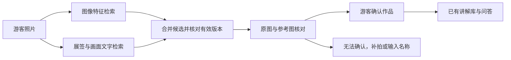

# 馆藏图片检索：实现与验证

2026-09-29。本页区分图像候选召回、身份核对及讲解生成；识别出候选不等于确定作品身份。

## 为什么修改

原先的照片 → 画面描述 → 文字检索链路，会在描述出错时漏掉正确作品。已知的海螺局部图被描述为布料，正确作品没有进入前 5 个候选。详见 [原始诊断](photo-partial-diagnosis.md)。

增加独立的图像特征检索，文字描述不再是召回作品的唯一依据。馆藏事实和讲解仍使用原有文字知识库。

## 已实现的链路

1. 上传检查、EXIF 去除、图片缩放沿用原实现；模型先判断图片是否可用于作品识别，并读取展签及可见信息。
2. 图像路径直接将照片送入本地 DINOv2 ViT-S/14，提取归一化的 384 维 CLS 特征；这一步不使用生成的文字描述。
3. 参考图和游客图都使用固定的整图与四个重叠区域，按余弦相似度匹配。同一作品多视角取最高分，按作品去重，提取前 3 件。
4. 与原文字检索前 5 件取并集。每个图像候选重新读取有效记录，检查来源版本，防止已归档或变更的内容被使用。
5. 多模态模型查看游客原图、候选资料和参考图，核对具体外形和姿态。不能因为存在近邻，就判定为同一作品。
6. 展示候选图片，必须由游客确认后才请求讲解。没有足够依据时仍拒绝匹配。



实现复用现有 PyTorch / Transformers 依赖。小图库使用 NumPy 精确匹配，没有增加向量数据库，也没有训练或微调视觉模型。分块是固定的图片预处理，不是目标检测、分割或局部几何匹配。视觉相似度不是置信概率。

模型来源：[Meta DINOv2](https://github.com/facebookresearch/dinov2/blob/main/MODEL_CARD.md)，Apache-2.0；下载版本固定为 `facebook/dinov2-small@ed25f3a31f01632728cabb09d1542f84ab7b0056`。模型提供视觉特征并支持近邻检索，不保证当前博物馆任务上的识别效果。

## 本地配置与回退

在已安装 `requirements-vector.lock` 的环境中显式下载模型：

```powershell
.venv/Scripts/python.exe scripts/download_visual_model.py
```

运行时只从本地加载 safetensors，不下载权重、不执行远端模型代码。配置示例：

```dotenv
MUSEUM_VISUAL_MANIFEST=data/private/visual-references.json
MUSEUM_VISUAL_MODEL=models/dinov2-small
```

清单格式如下，图片路径必须在清单所在目录内；实际图片与 SHA-256 由维护者提供：

```json
{
  "version": 1,
  "references": [{
    "id": "example-front",
    "source_id": "existing-corpus-id",
    "path": "example-front.jpg",
    "sha256": "actual-sha256-of-file",
    "source_url": "https://museum.example/collection/example",
    "license": "verified-license"
  }]
}
```

未知作品、路径越界、缺少来源或许可、图片哈希不一致均阻止启用，避免静默混用错误图库。删除 `MUSEUM_VISUAL_MANIFEST` 配置并重启，即回退到原文字候选路径。单次图片检索异常时保留文字路径，执行记录保存错误类别；不会声称使用了图片检索。健康接口通过 `photo_retrieval` 与 `visual_index_hash` 显示实际启用状态。

9 月 29 日初始试点：6 张参考图、4 件作品，其中 V&A 雕塑 3 张参考图，其余为 3 件 AIC 作品。下文历史评测对应此规模。9 月 30 日已扩充为 13 张参考图、11 件作品，文字记录共 20 件；新样本检查发现展厅图漏召回和拒识，见 [扩充记录](va-collection-expansion.md)。两个版本的结果不能直接视为效果提升。V&A 来源、图片、派生清单和私有测评报告均在忽略目录内，不上传 GitHub。

游客照片与特征不落盘；执行记录仅保存图片哈希、候选 ID、相似度、索引版本和调用状态。参考图库是维护者事先整理的资料，不能自动把游客照片加入库。

## 测评方法与边界

固定 4 张维基原图作为已知回归案例，不放入参考图库；图库使用另一个拍摄来源和馆方图片。加入 3 张库外相似雕塑作拒识测试；另有 3 张 AIC 图库原图只作连通检查，不计入泛化表现。

`scripts.evaluate_museum_visual` 支持两条路径对照：对同一照片复用同一份实际模型观察输出，比较纯文字候选与图像加文字候选。报告记录图片、语料、图库、模型版本与提示词版本。`--observation-report` 可按文件哈希重放之前的观察结果，隔离后续阶段的变化。

```powershell
.venv/Scripts/python.exe -m scripts.evaluate_museum_visual --cases data/private/visual-eval-cases.json --references data/private/visual-references.json --output eval/private/new-run.json --paired
```

评测会产生少量真实模型 API 调用；拒绝覆盖已有报告，拒绝验收图片与参考图哈希重复。已知回归例不是未见过的盲测；四件作品的小图库也不能代表大馆藏检索质量。模型服务连接失败单独记录，不能当作识别错误或改进收益。复用观察输出的第二个分支少了一次模型调用，其耗时不能与完整首分支直接比较。

首轮图像召回的 4 张维基图均将目标作品排在第一；仅本地特征查询约 0.27–0.36 秒，绝非整个识别接口耗时。反例试验发现另一件巴洛克雕塑曾被误选，保留了这一失败；部署前须验证身份核对修正，不能只报告正例。

## 最终验证与已启用状态

识别提示词 `museum-photo-v3-query-anchored` 明确：第一张图才是待识别的游客照片，后续图只是近邻参考，不能把参考图身份当作识别结果。固定原观察结果，仅修改这条核对指令后，局部正例匹配成功、此前误认的雕塑被拒绝。完整复查又验证了这个结果；这是支持该修正的实验线索，不是模型必然不误认的证明。

| 验证 | 实际结果 | 限制 |
|---|---|---|
| 最终版固定 10 例 | 9 例符合预期；1 例模型连接失败 | 包含 3 张图库原图，只能作连通检查 |
| 三张相似雕塑 | 最终版均返回无匹配 | 仅这三个反例，不代表普遍拒识率 |
| 实际网页代理接口补测 | 海螺局部、正面近景均返回正确候选；此前误认的雕塑被拒绝 | 含重新调用的图像观察阶段，约 13.3–13.9 秒／次 |
| 确认后讲解 | 选择作品后返回已有的简明讲解 | 未改变讲解文本 |
| 自动化回归 | Python 103 项、手机 HTTP UUID 2 项通过 | 新增视觉模块测试 11 项；没有训练准确率含义 |

实际接口补测覆盖了固定复查中因连接失败未完成的正面近景。原始失败报告保留在本地，不将补测成功回写成“首轮全通过”。测试期间外部模型服务存在偶发连接失败，此次没有新增自动重试。

本机已启用图片检索，桌面和局域网手机健康接口均返回 `photo_retrieval=image_and_text`。图片特征模型、本地索引、实际识别接口均运行过。尚未验证用户手机拍摄电脑屏幕的原始上传文件、真实展厅照片、大规模馆藏或更多相似作品。

代码归档不含本地 V&A 图库与权重。新机器需要自行准备获准使用的参考图和清单，不能仅克隆代码就宣称复现 V&A 私有试点。
